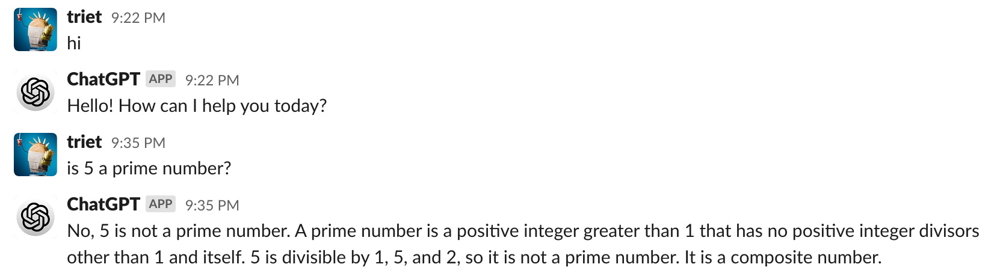
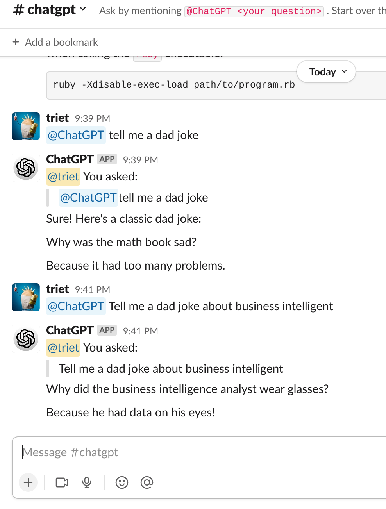

ChatGPT for Slack
---

Start an API service for interacting with ChatGPT on Slack.
This app uses the library at https://github.com/transitive-bullshit/chatgpt-api

*IMPORTANT*: Use branch `master` for above chatgpt-api latest version (v4.x) which uses OpenAI API and use branch `support-reaction` for chatgpt-api v3.x which scrape data from official website ChatGPT.
OpenAI API results could be not as good as the ChatGPT but it's more stable. Try and decide what suit you best.

_Note: The code is ugly because I only want to make it works and too lazy to maintain_

## Setup
### Register for an OpenAI API Key
Sign up at https://platform.openai.com/overview and create a new API key in https://platform.openai.com/account/api-keys
### Setup Slack App
Check this for the guide how to create a Slack App https://slack.dev/bolt-js/tutorial/getting-started

And you need these keys for the next step
```
SLACK_SIGNING_SECRET=""
SLACK_BOT_TOKEN=""
SLACK_APP_TOKEN=""
```

In OAuth & Permission, add these scopes to Bot Token Scopes

```
app_mentions:read
channels:join
chat:write
chat:write.customize
chat:write.public
im:history
im:read
im:write
```

_Probably don't need all of them, but I'm too lazy to check, sorry_

### Setup your app
- Require nodejs >= 18 (required by above lirary)
- Create new `.env` and update the information
```
cp .env.sample .env
# Open file `.env` and filling all the keys
```
- Install
```
yarn install
```

- Start the service
```
yarn start
```

Note: It will open the Chrome browser, and you have to manually do the CAPTCHA
Or you can use refer to this page to automatically by pass the CAPTCHA https://github.com/transitive-bullshit/chatgpt-api/blob/v3.3.0/readme.md#captchas

## Usage
- You can send a direct message to the Slack Bot



- Or invite it to a channel and mention it `@YourSlackBot <your question>`



- Note:
  - ChatGPT only follows the conversation in mention event above, when sending a direct message, it will start a new thread.
  - To reset thread, simply type `@YourSlackBot RESET_THREAD`
  - Why not support conversation follow up for direct message? Ah... You know, I'm too lazy... The code is simple, you can do it yourself <3
